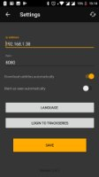
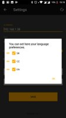
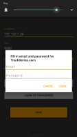

**PlayOnKodi** is android app that aims to help you watch your favorite TV Shows with ease and for free.
It keeps track of your watched episoded and lets you play next one with single tap.

As name suggest primary point of this app is to watch TV Shows on Kodi. 
But there is also possibility to watch TV Shows on your android device.

Furthermore you can share Youtube videos (or any mp4 file on internet) into PlayOnKodi app and it will start playing on Kodi.

## Get started
1. [Enable installation of apps from Unknown Sources](https://www.applivery.com/docs/troubleshooting/android-unknown-sources)
2. Download [PlayOnKodi](play-on-kodi-update-server.herokuapp.com/download/latest/sk.p1ro.playonkodi)
3. Install downloaded app
4. If you plan to use it Kodi fill in Ip and port of Kodi
	* Optionally install (Kodi addon)[#kodi-addon]
5. Login to Trackseries
6. Add Tv Shows to your list
7. Enjoy
	
## Security concerns
This app doesn't store any data about you.
Even email and password, when you are logging into Trackseries, arn't stored on device (or anywhere else).

At first start there prompt to access external storage, this is needed only for downloading subtitles to your device when watching TV shows locally.

## Screenshots

	
	
	
	
	
	

	<small class="caption">
		Click on an image to enlarge it.
	</small>

## Kodi addon (optional)
Coming soon...

## FAQ

	
How to login into TrackSeries

	

	

	
How to fill Ip address and Port

	

	

	
How to add new TV Show

	

	

	
What about updates ?

	

	

	
How to check for updates ?

	

	

	
Why not using Google Play ?

	

	

	
<h2>DMCA</h2>

	

		The owner of PlayOnKodi app wants to indicate the following: there is no copyright protected content stored in PlayOnKodi app.
		All offered files are stored on external file hosts that are in no way associated with PlayOnKodi.
		If you are a rights holder of a file listed here, do not contact us, but the providers on whose servers any copyrighted material is stored.
		PlayOnKodi offers, acting like a search engine, only links to files and not the files themself,
		this is the reason why the owners of this website are not responsible and according to Teleservices Act also can not be held liable.
		We dissociate ourselves from the contents and have no influence on it. PlayOnKodi is merely a facilitator of external content,
		for legally protected content the providers hosting this content (filehosters) are responsible.
	

